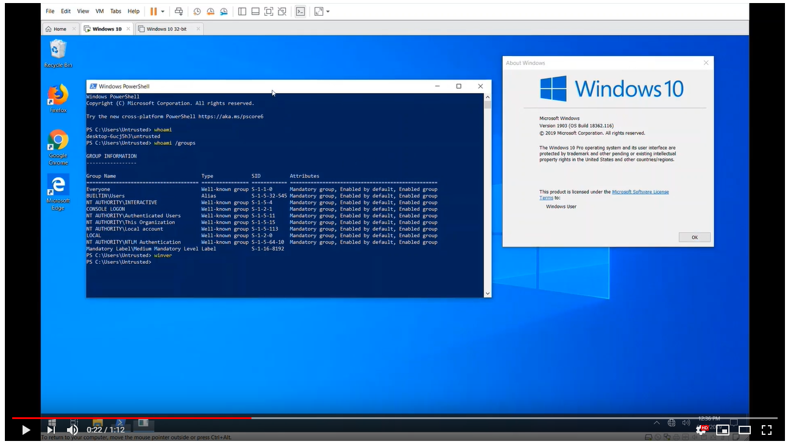

# CTFTOOL

>
> Just want to test the SYSTEM exploit? [Click here](#Exploit).
>

[](https://www.youtube.com/watch?v=quenNNqoDBs)

## An Interactive CTF Exploration Tool

This is `ctftool`, an interactive command line tool to experiment with CTF, a
little-known protocol used on Windows to implement Text Services. This might
be useful for studying Windows internals, debugging complex issues with Text
Input Processors and analyzing Windows security.

It is possible to write simple scripts with `ctftool` for automating interaction
with CTF clients or servers, or perform simple fuzzing.

## Background

There is a blog post that accompanies the release of this tool available here.

[https://googleprojectzero.blogspot.com/](https://googleprojectzero.blogspot.com/)

## Usage

`ctftool` has been tested on Windows 7, Windows 8 and Windows 10. Both 32-bit
and x64 versions are supported, but x64 has been tested more extensively.

There is online help for most commands, simply type `help` to see a list of
commands, and `help <command>` to see detailed help for a particular command.

```
$ ./ctftool.exe
An interactive ctf exploration tool by @taviso.
Type "help" for available commands.
Most commands require a connection, see "help connect".
ctf> help
Type `help <command>` for help with a specific command.
Any line beginning with # is considered a comment.

help            - List available commands.
exit            - Exit the shell.
connect         - Connect to CTF ALPC Port.
info            - Query server informaiton.
scan            - Enumerate connected clients.
callstub        - Ask a client to invoke a function.
createstub      - Ask a client to instantiate CLSID.
hijack          - Attempt to hijack an ALPC server path.
sendinput       - Send keystrokes to thread.
setarg          - Marshal a parameter.
getarg          - Unmarshal a parameter.
wait            - Wait for a process and set it as the default thread.
thread          - Set the default thread.
sleep           - Sleep for specified milliseconds.
forget          - Forget all known stubs.
stack           - Print the last leaked stack ptr.
marshal         - Send command with marshalled parameters.
proxy           - Send command with proxy parameters.
call            - Send command without appended data.
window          - Create and register a message window.
patch           - Patch a marshalled parameter.
module          - Print the base address of a module.
module64        - Print the base address of a 64bit module.
editarg         - Change the type of a marshalled parameter.
symbol          - Lookup a symbol offset from ImageBase.
set             - Change or dump various ctftool parameters.
show            - Show the value of special variables you can use.
lock            - Lock the workstation, switch to Winlogon desktop.
repeat          - Repeat a command multiple times.
run             - Run a command.
script          - Source a script file.
print           - Print a string.
consent         - Invoke the UAC consent dialog.
reg             - Lookup a DWORD in the registry.
Most commands require a connection, see "help connect".
ctf>
```

The first thing you will want to do is connect to a session, and see which
clients are connected.

```
ctf> connect
The ctf server port is located at \BaseNamedObjects\msctf.serverDefault1
NtAlpcConnectPort("\BaseNamedObjects\msctf.serverDefault1") => 0
Connected to CTF server@\BaseNamedObjects\msctf.serverDefault1, Handle 00000264
ctf> scan
Client 0, Tid 3400 (Flags 0x08, Hwnd 00000D48, Pid 8696, explorer.exe)
Client 1, Tid 7692 (Flags 0x08, Hwnd 00001E0C, Pid 8696, explorer.exe)
Client 2, Tid 9424 (Flags 0x0c, Hwnd 000024D0, Pid 9344, SearchUI.exe)
Client 3, Tid 12068 (Flags 0x08, Hwnd 00002F24, Pid 12156, PROCEXP64.exe)
Client 4, Tid 9740 (Flags 0000, Hwnd 0000260C, Pid 3840, ctfmon.exe)
```

You can then experiment by sending and receiving commands to the server, or any
of the connected clients.

## Building

I used GNU make and Visual Studio 2019 to develop `ctftool`. Only 32-bit builds
are supported, as this allows the tool to run on x86 and x64 Windows.

If all the dependencies are installed, just typing `make` in a developer command
prompt should be enough.

I use the "Build Tools" variant of Visual Studio, and the only components I have
selected are MSVC, MSBuild, CMake and the SDK.

This project uses submodules for some of the dependencies, be sure that you're
using a command like this to fetch all the required code.

```
git submodule update --init --recursive
```

## Exploit

> The examples only work on Windows 10 x64. All platforms and versions since
> Windows XP are affected, but no PoC is currently implemented.

This tool was used to discover many critical security problem with the CTF
protocol that have existed for decades.

If you just want to test an exploit, follow these steps:

```
> ctftool.exe
An interactive ctf exploration tool by @taviso.
Type "help" for available commands.
Most commands require a connection, see "help connect".
ctf> script .\scripts\ctf-consent-system.ctf
```

This will wait for the UAC dialog to appear, compromise it and start a shell.

In fact, the exploit code is split into two stages that you can use
independently.

Most CTF clients can be compromised, as the kernel forces applications that draw
windows to load the vulnerable library.

Simply connect to a session, select a client to compromise (use the `scan` and
`thread` commands, or just `wait`), then:

```
ctf> script .\scripts\ctf-exploit-common-1903.ctf
```

## Status

At the time of writing, it is unknown how Microsoft will change the CTF
protocol in response to the numerous design flaws this tool helped expose.

For that reason, consider this tool to be in proof-of-concept state.

## Acronym

Microsoft doesn't document what CTF stands for, it's not explained in any
of the Text Services documentation, SDK samples, symbol names, header files,
or anywhere else. My theory is it's from `CTextFramework`, what you might name
the class in [hungarian notation](http://web.mst.edu/~cpp/common/hungarian.html).

> There are some websites that claim `ctfmon` has something to do with Clear
> Type Fonts or the Azure Collaborative Translation Framework. They're mistaken.

## Authors

Tavis Ormandy <taviso@google.com>

## License

All original code is Apache 2.0, See LICENSE file for details.

The following components are imported third party projects.

* [pe-parse](https://github.com/trailofbits/pe-parse), by Andrew Ruef et al.
  * pe-parse is used to implement a `GetProcAddress()` for 64-bit modules from a
    32-bit process. This is used in the `symbol` command, and allows the same
    binary to work on x64 and x86.
* [wineditline](http://mingweditline.sourceforge.net/), by Paolo Tosco.
  * wineditline is used to implement user friendly command-line input and
    history editing.
* [dynamorio](https://www.dynamorio.org/), by Derek Bruening et al.
  * I borrowed some of the prototypes and type definitions from DR.
* [ntdll.h](http://www.zezula.net/en/prog/lpc.html), by Ladislav Zezula.
  * Ladislav collected some structure definitions and prototoypes from
    various WDK, DDK, SDK releases into one convenient file.
